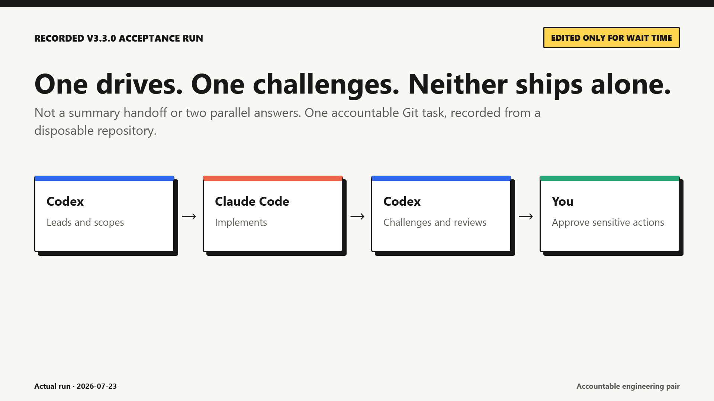

# Launch Kit

This directory contains publication material for `codex-claude-handoff` v3.3.1.
It is separate from the installable Skill and does not change runtime behavior.

## Launch position

Use one sentence consistently:

> Codex-Claude Handoff turns two coding agents into an accountable engineering
> pair: one drives, another challenges and reviews, and neither ships alone.

Support that sentence with the verified operating model: one live Git task,
durable project-local state, a bounded review-and-correction path, exact-scope
checks, and user approval for sensitive actions.

Do not describe the project as fully autonomous, an unrestricted agent
conversation, a hidden chat bridge, or a native VS Code extension.

## Package contents

- `DEMO.md` - the reproducible five-minute demonstration and recording storyboard.
- `POSTS.md` - publication copy for LinkedIn, Reddit, Hacker News, X, and direct sharing.
- `DISCORD.md` - ready-to-post Discord copy, attachments, and the concise
  differentiation reply.
- `FAQ.md` - concise answers to expected technical and trust questions.
- `CHECKLIST.md` - go/no-go gates, publication order, and useful launch metrics.
- `LIVE_DEMO_EVIDENCE.md` - exact outcome, limitations, and transcript hashes from
  the recorded public-beta run.
- `assets/codex-claude-handoff-live-demo.mp4` - 60-second live-run edit for native
  upload to LinkedIn, Reddit, or direct sharing.
- `assets/codex-claude-handoff-live-demo.gif` - lightweight inline preview.
- `assets/codex-claude-handoff-live-demo-poster.png` - video poster and link image.
- `assets/live-demo.html` - editable scene source for the live demo.
- `assets/render-live-demo.js` - reproducible Chrome and FFmpeg renderer.
- `assets/social-card.html` - editable source for the social image.
- `assets/social-card.png` - rendered 1200 x 630 launch image.

## Live demo

[](assets/codex-claude-handoff-live-demo.mp4)

The recording is based on a disposable repository and an actual v3.3.0 run. It
shows Codex routing, Claude Code implementing, the exact-scope guard stopping a
metadata mismatch, Codex reviewing after the coordination repair, and the workflow
stopping at the user before commit. See `LIVE_DEMO_EVIDENCE.md` for the precise
claim and raw transcript hashes.

## Publication gate

Do not begin the broad launch until both of these checks pass:

```powershell
npx skills find codex-claude-handoff
```

The skills.sh page must also show the v3.3.1 positioning and Skill text rather than the older
"Codex Adapter" copy:

https://www.skills.sh/siglernir-ai/codex-claude-handoff/codex-claude-handoff

Direct GitHub sharing and small invited pilots are safe before that index refresh.

## Recommended order

1. Review the recorded demo and evidence without editing out failures.
2. Publish the LinkedIn post with the MP4 uploaded natively.
3. Publish one tailored Reddit post, starting with `r/codex`.
4. Wait 48-72 hours, answer questions, and fix onboarding friction.
5. Publish to `r/ClaudeCode` only with a Claude-specific framing.
6. Consider Show HN after at least two external users complete the workflow.

Avoid simultaneous identical cross-posts. Early replies and issue handling matter
more than raw impression count.
